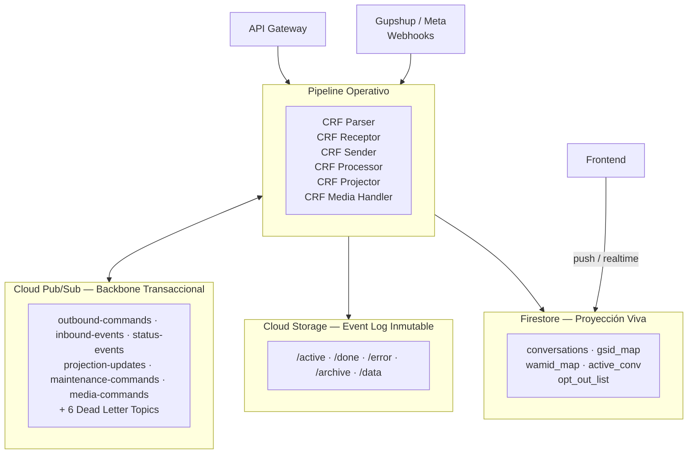
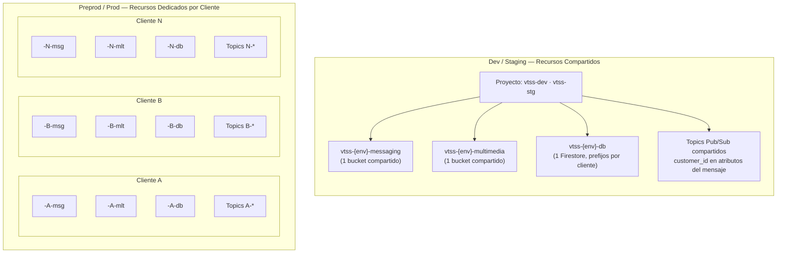
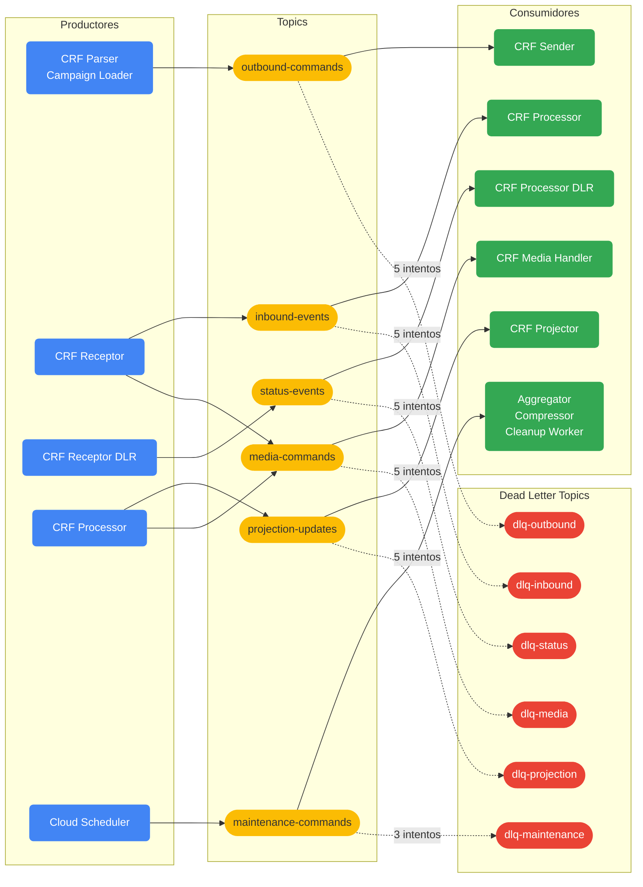
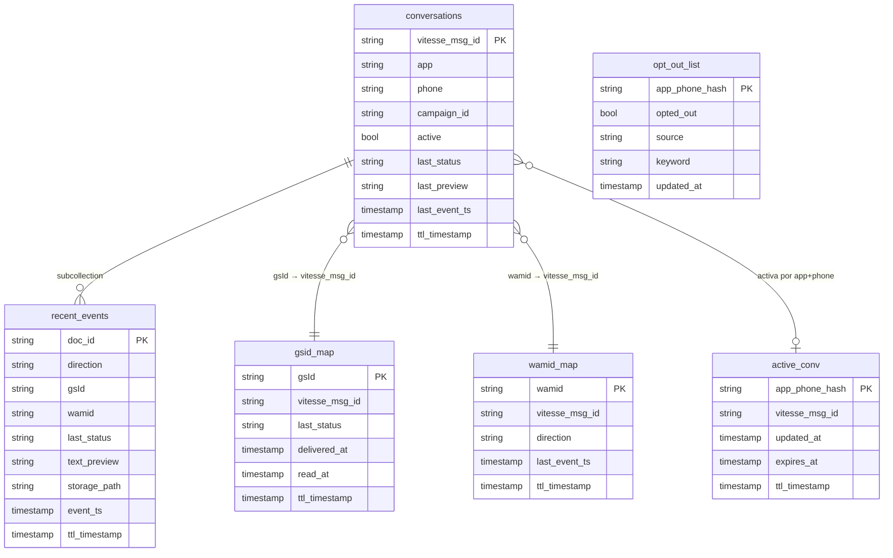
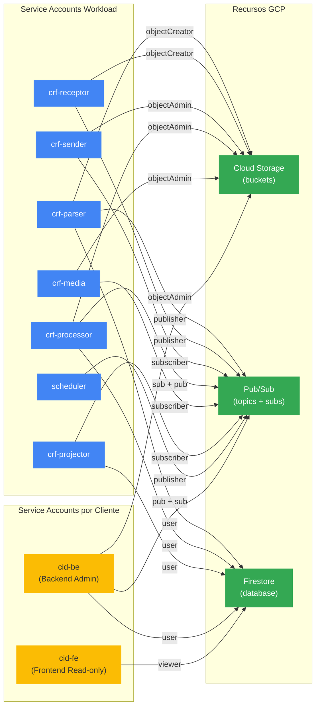
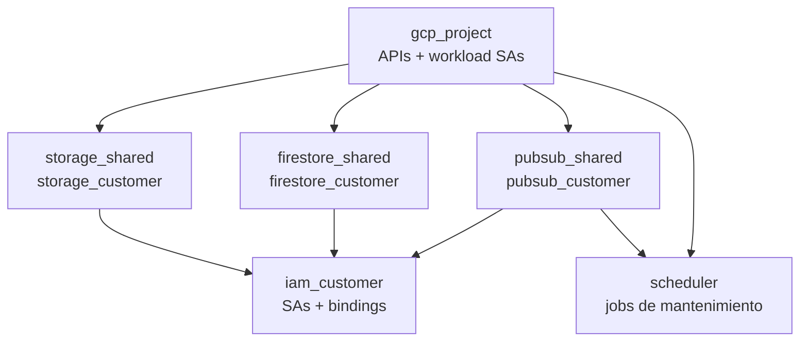
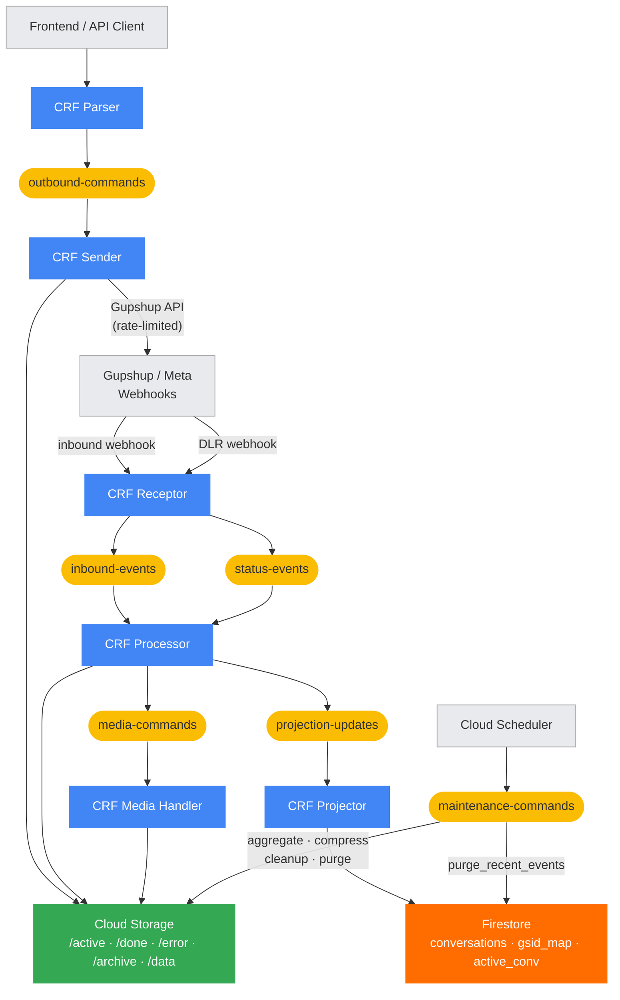
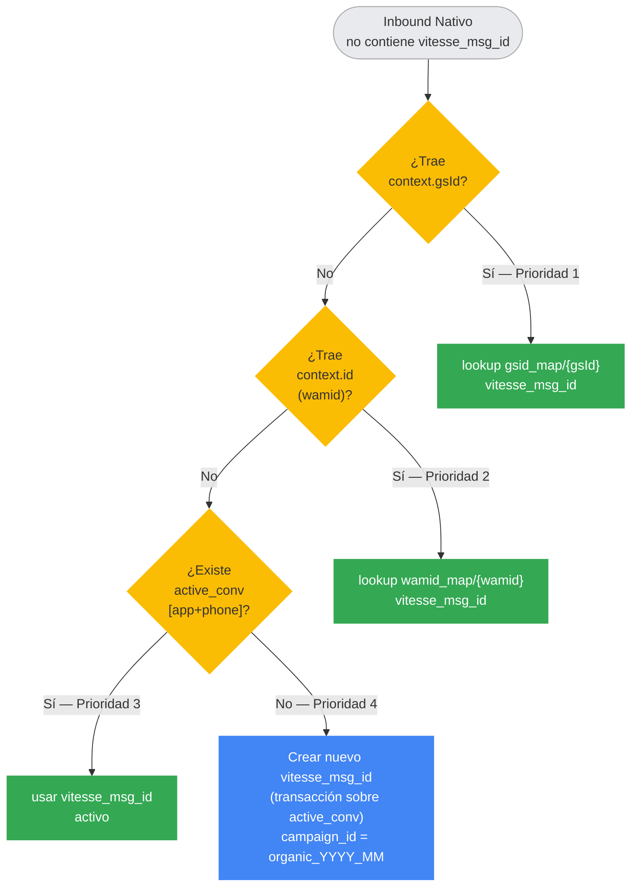
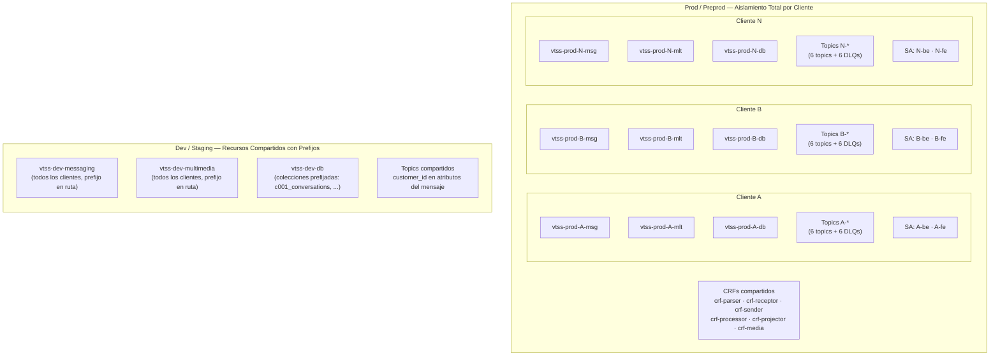
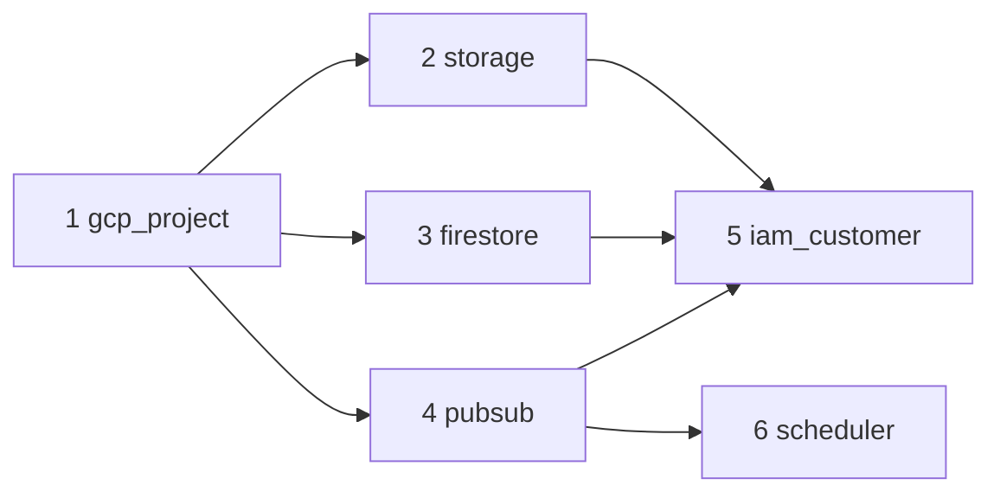

# Vitesse v11 — Infraestructura GCP con Terraform

<div align="center">


-34A853?logoColor=white)

**WhatsApp Messaging Platform on GCP · Arquitectura Operativa v11 · Mayo 2026**

</div>

---

## Tabla de Contenido

1. [Visión General](#1-visión-general)
2. [Principios de Diseño](#2-principios-de-diseño)
3. [Estrategia de Ambientes](#3-estrategia-de-ambientes)
4. [Convención de Nomenclatura](#4-convención-de-nomenclatura)
5. [Arquitectura de Storage](#5-arquitectura-de-storage)
6. [Backbone Transaccional — Pub/Sub](#6-backbone-transaccional--pubsub)
7. [Proyección Viva — Firestore](#7-proyección-viva--firestore)
8. [Estrategia IAM y Seguridad](#8-estrategia-iam-y-seguridad)
9. [Estructura de Módulos Terraform](#9-estructura-de-módulos-terraform)
10. [Diagramas de Despliegue](#10-diagramas-de-despliegue)
11. [Guía de Despliegue](#11-guía-de-despliegue)

---

## 1. Visión General

Vitesse v11 es una plataforma de mensajería multicanal (WhatsApp, Instagram, Messenger) desplegada sobre GCP. La arquitectura **elimina Cloud SQL del hot path operativo** y lo reemplaza con tres capas especializadas y complementarias:

| Capa | Servicio GCP | Responsabilidad |
|:----:|:------------:|:----------------|
| **Event Log** | Cloud Storage | Registro inmutable de eventos — `/active`, `/done`, `/error`, `/archive`, `/data` |
| **Backbone Transaccional** | Cloud Pub/Sub | Desacoplamiento total, buffering, reintentos y DLQ entre todos los componentes |
| **Proyección Viva** | Firestore Native | Índices de correlación y vista viva para el frontend sin polling |

> **Regla de diseño core:** Ningún componente de negocio invoca a otro directamente. Todo evento operativo —outbound, inbound, status, media, maintenance— pasa primero por Pub/Sub.

### Arquitectura de Tres Capas



---

## 2. Principios de Diseño

| Principio | Decisión de Arquitectura | Resultado Esperado |
|:----------|:------------------------|:-------------------|
| Conversación como entidad raíz | `vitesse_msg_id` es la raíz de conversación | Todos los `gsId`/`wamid` se correlacionan contra un mismo hilo |
| Event log barato | `/active` + `/archive` + `/data` en Cloud Storage | Replay, compresión, auditoría y analítica sin saturar la BD |
| Lookup rápido | Firestore para índices y proyección viva | Frontend y correlación sin listar objetos en Storage |
| Frontend por push | Firestore + listeners desde backend | Sin polling, menor latencia visible |
| Campaign siempre presente | `campaign_id` real o sintético mensual (`organic_YYYY_MM`) | Trazabilidad comercial completa |
| Multi-tenant estricto | Recursos dedicados en prod/preprod, prefijos en dev/staging | Aislamiento de datos garantizado por cliente |

---

## 3. Estrategia de Ambientes

### 3.1 Topología de los Cuatro Ambientes



### 3.2 Dev y Staging — Recursos Compartidos

- **Cloud Storage:** 1 bucket de mensajería + 1 bucket multimedia. El prefijo del objeto incluye el `customer_id` para separación lógica.
- **Firestore:** 1 base de datos compartida. Los nombres de colección llevan prefijo `{customer_id}_` (ej. `c001_conversations`).
- **Pub/Sub:** 1 conjunto de topics compartidos. El `customer_id` viaja como atributo del mensaje para routing.
- **IAM:** Cuentas de servicio compartidas por rol (no por cliente).
- **Propósito:** Desarrollo activo y pruebas de integración. Costo mínimo.

### 3.3 Preprod y Prod — Recursos Dedicados por Cliente

- **Cloud Storage:** 1 bucket de mensajería + 1 bucket multimedia **por cliente**. Sin mezcla de datos entre clientes.
- **Firestore:** 1 base de datos Native **por cliente** (Named Databases). TTL y reglas de seguridad independientes.
- **Pub/Sub:** 1 conjunto completo de topics + subscriptions + DLQs **por cliente**. Aislamiento de throughput y errores.
- **IAM:** Cuentas de servicio backend y frontend **por cliente**. Principio de mínimo privilegio estricto.
- **Propósito:** Preprod = validación con datos reales. Prod = producción.

---

## 4. Convención de Nomenclatura

### 4.1 Patrón General

```
vtss-{env}-{customer_id}-{sufijo}
```

| Componente | Valores | Notas |
|:-----------|:--------|:------|
| `vtss` | fijo | Prefijo de plataforma Vitesse |
| `env` | `dev` · `stg` · `preprod` · `prod` | Ambiente de despliegue |
| `customer_id` | alfanumérico con `-` y `_` | **Solo en preprod/prod** |
| `sufijo` | `msg` · `mlt` · `db` · `be` · `fe` · `{topic}` | Tipo de recurso |

### 4.2 Tabla de Nomenclatura por Recurso

| Recurso | Dev / Staging | Preprod / Prod |
|:--------|:-------------|:---------------|
| Proyecto GCP | `vtss-dev` / `vtss-stg` | `vtss-preprod` / `vtss-prod` |
| Bucket Mensajería | `vtss-{env}-messaging` | `vtss-{env}-{cid}-msg` |
| Bucket Multimedia | `vtss-{env}-multimedia` | `vtss-{env}-{cid}-mlt` |
| Firestore Database | `vtss-{env}-db` | `vtss-{env}-{cid}-db` |
| Topic `outbound-commands` | `vtss-{env}-outbound-commands` | `vtss-{env}-{cid}-outbound-commands` |
| Topic `inbound-events` | `vtss-{env}-inbound-events` | `vtss-{env}-{cid}-inbound-events` |
| Topic `status-events` | `vtss-{env}-status-events` | `vtss-{env}-{cid}-status-events` |
| Topic `projection-updates` | `vtss-{env}-projection-updates` | `vtss-{env}-{cid}-projection-updates` |
| Topic `maintenance-commands` | `vtss-{env}-maintenance-commands` | `vtss-{env}-{cid}-maintenance-commands` |
| Topic `media-commands` | `vtss-{env}-media-commands` | `vtss-{env}-{cid}-media-commands` |
| DLQ Topic | `vtss-{env}-dlq-{topic}` | `vtss-{env}-{cid}-dlq-{topic}` |
| SA Backend cliente | — | `vtss-{env}-{cid}-be@{project}.iam.gserviceaccount.com` |
| SA Frontend cliente | — | `vtss-{env}-{cid}-fe@{project}.iam.gserviceaccount.com` |
| SA CRF (workload) | `vtss-{env}-crf-{role}@...` | `vtss-{env}-crf-{role}@...` (compartido) |

---

## 5. Arquitectura de Storage

### 5.1 `MESSAGING_STORAGE` — Estructura de Directorios

El bucket de mensajería organiza sus objetos según el contrato de identificadores definido en los documentos de arquitectura.

> **`vm_conv_id`** = `{channel_provider}/{channel_identifier}/{contact_identifier}`
> **`vm_msg_id`** = `YYYYMMDD/{timestamp}-{uuid[:6]}.json`

```
vtss-{env}-{cid}-msg/
│
├── active/                               ← Live Queue: operaciones en vuelo
│  ├── todo/                              ← Pendientes de procesar
│  │  ├── outbound/
│  │  │  └── {channel_provider}/{channel_identifier}/{contact_identifier}/  ← vm_conv_id
│  │  │    └── YYYYMMDD/{timestamp}-{uuid[:6]}.json        ← vm_msg_id
│  │  └── inbound/
│  │    ├── message/
│  │    │  └── {channel_provider}/{channel_identifier}/{contact_identifier}/
│  │    │    └── YYYYMMDD/{timestamp}-{uuid[:6]}.json
│  │    └── status/
│  │      └── {channel_provider}/{channel_identifier}/{contact_identifier}/
│  │        └── YYYYMMDD/{timestamp}-{uuid[:6]}.json
│  └── in_process/                           ← Siendo procesados actualmente
│    ├── outbound/
│    │  └── {channel_provider}/{channel_identifier}/{contact_identifier}/
│    │    └── YYYYMMDD/{timestamp}-{uuid[:6]}.json
│    └── inbound/
│      ├── message/...
│      └── status/...
│
├── done/                                ← Procesados exitosamente
│  ├── outbound/
│  │  └── {channel_provider}/{channel_identifier}/{contact_identifier}/
│  │    └── YYYYMMDD/{timestamp}-{uuid[:6]}.json
│  └── inbound/
│    ├── message/...
│    └── status/...
│
├── error/                                ← DLQ agotado / sin ack del proveedor
│  ├── outbound/...
│  └── inbound/
│    ├── message/...
│    └── status/...
│
├── campaign/                              ← Estructura secundaria de punteros
│  └── {channel_provider}/{channel_identifier}/{campaign_id}/
│
├── data/                                ← Archivos resumen — Aggregator
│  └── {channel_provider}/{channel_identifier}/YYYYMMDD.parquet
│
└── archive/                               ← Archivos comprimidos — Compressor
  └── {channel_provider}/{channel_identifier}/YYYYMMDD.jsonl.gz
```

#### Valores de `channel_provider`

| Canal | `channel_provider` | `channel_identifier` | `contact_identifier` |
|:------|:-------------------|:---------------------|:---------------------|
| WhatsApp | `whatsapp_business_account` | `phone_number_id` | `user_id` |
| Instagram | `instagram` | `entry[].id` | `entry[].messaging.sender.id` |
| Messenger | `page` | `entry[].id` | `entry[].messaging.sender.id` |

#### Regla de nacimiento de objetos

| Tipo de evento | Ruta de creación inicial |
|:---------------|:------------------------|
| Outbound | `active/todo/outbound/{vm_conv_id}/YYYYMMDD/{timestamp}-{uuid[:6]}.json` |
| Inbound message | `active/todo/inbound/message/{vm_conv_id}/YYYYMMDD/{timestamp}-{uuid[:6]}.json` |
| Inbound status (DLR) | `active/todo/inbound/status/{vm_conv_id}/YYYYMMDD/{timestamp}-{uuid[:6]}.json` |

### 5.2 `MULTIMEDIA_STORAGE` — Estructura de Directorios

```
vtss-{env}-{cid}-mlt/
│
├── catalog_files/
│  └── {file_name}-{hash}.{ext}               ← Assets reutilizables del cliente
│
└── conversational_files/
  └── {channel_provider}/{channel_identifier}/{contact_identifier}/  ← vm_conv_id
    └── {file_name}-{hash}.{ext}             ← SHA-256 en metadata
```

La estructura basada en `vm_conv_id` permite permisos dinámicos, expiración por conversación y auditoría por contacto.

### 5.3 Lifecycle Rules de Cloud Storage

| Prefijo | Acción | Condición |
|:--------|:------:|:---------:|
| `done/` | Delete | age > **45 días** |
| `active/in_process/` | Delete | age > **7 días** (huérfanos) |
| `error/` | Delete | age > **90 días** |
| `archive/` | → Nearline | age > **30 días** |
| `archive/` | → Coldline | age > **365 días** |
| `data/` | → Nearline | age > **30 días** |
| `data/` | Delete | age > **730 días** |
| `conversational_files/` (multimedia) | → Nearline | age > **90 días** |

### 5.4 Dev/Staging — Separación por Prefijo de Objeto

En dev/staging el `customer_id` es el primer segmento de ruta para mantener el aislamiento lógico dentro del bucket compartido:

```
active/todo/outbound/{customer_id}/{channel_provider}/{channel_identifier}/{contact_identifier}/YYYYMMDD/{timestamp}-{uuid[:6]}.json
archive/{customer_id}/{channel_provider}/{channel_identifier}/YYYYMMDD.jsonl.gz
data/{customer_id}/{channel_provider}/{channel_identifier}/YYYYMMDD.parquet
```

---

## 6. Backbone Transaccional — Pub/Sub

### 6.1 Topología de Topics, DLQs y Subscriptions



### 6.2 Configuración de Topics

| Topic | Retención | Max Intentos | Ack Deadline | DLQ |
|:------|:---------:|:------------:|:------------:|:----|
| `outbound-commands` | 7 días | 5 | 60 s | `dlq-outbound` |
| `inbound-events` | 7 días | 5 | 30 s | `dlq-inbound` |
| `status-events` | 7 días | 5 | 30 s | `dlq-status` |
| `projection-updates` | 3 días | 5 | 30 s | `dlq-projection` |
| `maintenance-commands` | 1 día | 3 | 120 s | `dlq-maintenance` |
| `media-commands` | 3 días | 5 | 120 s | `dlq-media` |
| *(todos los DLQ)* | 7 días | manual | 600 s | — |

### 6.3 Contrato de Atributos Pub/Sub

<details>
<summary><strong>outbound-commands</strong></summary>

```json
{
 "attributes": {
  "event_type": "outbound_command",
  "vitesse_msg_id": "...",
  "campaign_id": "...",
  "client_id": "...",
  "phone_hash": "...",
  "storage_path": "...",
  "local_ref": "...",
  "event_ts": "ISO-8601"
 },
 "body": { "storage_path": "...", "local_ref": "..." }
}
```
</details>

<details>
<summary><strong>inbound-events</strong></summary>

```json
{
 "attributes": {
  "event_type": "inbound_message",
  "wamid": "...",
  "client_id": "...",
  "campaign_id": "...",
  "vitesse_msg_id": "... (si ya fue resuelto)",
  "storage_path": "...",
  "event_ts": "ISO-8601"
 },
 "body": { "storage_path": "..." }
}
```
</details>

<details>
<summary><strong>status-events</strong></summary>

```json
{
 "attributes": {
  "event_type": "status_event",
  "gsId": "...",
  "status": "enqueued | sent | delivered | read | failed",
  "client_id": "...",
  "campaign_id": "...",
  "vitesse_msg_id": "...",
  "storage_path": "...",
  "event_ts": "ISO-8601"
 },
 "body": { "storage_path": "..." }
}
```
</details>

<details>
<summary><strong>projection-updates</strong></summary>

```json
{
 "attributes": {
  "event_type": "projection_update",
  "vitesse_msg_id": "...",
  "client_id": "...",
  "campaign_id": "...",
  "storage_path": "...",
  "entity_target": "firestore"
 },
 "body": { "storage_path": "..." }
}
```
</details>

<details>
<summary><strong>maintenance-commands</strong></summary>

```json
{
 "attributes": {
  "event_type": "maintenance_command",
  "command_type": "aggregate | compress | cleanup | purge_recent_events",
  "target_date": "YYYY-MM-DD"
 },
 "body": { "customer_id": "...", "job_params": {} }
}
```
</details>

<details>
<summary><strong>media-commands</strong></summary>

```json
{
 "attributes": {
  "event_type": "media_command",
  "media_type": "...", "mime_type": "...",
  "vm_conv_id": "...", "vm_msg_id": "...",
  "gsId": "...", "wamid": "...",
  "client_id": "...", "campaign_id": "...",
  "vitesse_msg_id": "...", "event_ts": "ISO-8601"
 },
 "body": {
  "source_storage_url": "...",
  "target_storage_url_prefix": "...",
  "file_name": "...",
  "file_hash": "sha256:..."
 }
}
```
</details>

### 6.4 Cloud Scheduler — Jobs de Mantenimiento

| Job | Schedule (cron) | Zona Horaria | `command_type` |
|:----|:---------------:|:------------:|:---------------|
| Aggregator diario | `0 1 * * *` | America/Bogota | `aggregate` |
| Compressor D-30 | `0 2 * * *` | America/Bogota | `compress` |
| Cleanup active | `0 * * * *` | America/Bogota | `cleanup` |
| Purge `recent_events` | `0 3 * * 0` | America/Bogota | `purge_recent_events` |

---

## 7. Proyección Viva — Firestore

### 7.1 Modelo de Colecciones



### 7.2 TTL por Colección

| Colección | TTL | Campo TTL | Notas |
|:----------|:---:|:---------:|:------|
| `conversations` | **30 días** | `ttl_timestamp` | Documento raíz de conversación |
| `recent_events` | **30 días** + cap 100 | `ttl_timestamp` | Truncado por job Compressor |
| `gsid_map` | **90 días** | `ttl_timestamp` | Proyección consolidada outbound + DLRs |
| `wamid_map` | **90 días** | `ttl_timestamp` | |
| `active_conv` | **72 h** | `ttl_timestamp` | Configurable por tenant |
| `opt_out_list` | Sin TTL | — | Requiere baja explícita |
| `contacts` | **365 días** | `ttl_timestamp` | |
| `contacts_lists` | **365 días** | `ttl_timestamp` | |
| `contact_segments` | **365 días** | `ttl_timestamp` | |
| `broadcast_list` | **365 días** | `ttl_timestamp` | |
| `messages_conversations` | **60 días** | `ttl_timestamp` | |
| `conversations_audit_history` | **120 días** | `ttl_timestamp` | |

### 7.3 Separación en Dev/Staging (DB compartida)

Las colecciones llevan prefijo `{customer_id}_` en la base de datos compartida:

```
vtss-dev-db/
├── c001_conversations/{vitesse_msg_id}
├── c001_gsid_map/{gsId}
├── c001_active_conv/{hash}
├── c002_conversations/{vitesse_msg_id}
└── c002_gsid_map/{gsId}
  ...
```

### 7.4 Reglas de Materialización

1. Los DLRs (`enqueued` / `sent` / `delivered` / `read`) **no crean documentos nuevos** en `recent_events`. Actualizan `last_status` con merge condicional — nunca retroceder un estado (no-downgrade: `delivered` → `sent` está prohibido).
2. `recent_events` conserva máximo **100 mensajes visibles** por conversación; el job `purge_recent_events` ejecuta el truncado asincrónicamente.
3. `gsid_map/{gsId}` recibe la proyección técnica **consolidada** del outbound y todos sus DLRs.

---

## 8. Estrategia IAM y Seguridad

### 8.1 Service Accounts — Workload (compartidas por ambiente)

| Service Account | Storage | Pub/Sub | Firestore |
|:----------------|:-------:|:-------:|:---------:|
| `vtss-{env}-crf-parser` | `objectCreator` | `publisher` | `user` |
| `vtss-{env}-crf-receptor` | `objectCreator` | `publisher` | — |
| `vtss-{env}-crf-sender` | `objectAdmin` | `subscriber` | — |
| `vtss-{env}-crf-processor` | `objectAdmin` | `subscriber` + `publisher` | `user` |
| `vtss-{env}-crf-media` | `objectAdmin` | `subscriber` | — |
| `vtss-{env}-crf-projector` | — | `subscriber` | `user` |
| `vtss-{env}-scheduler` | — | `publisher` | — |

### 8.2 Service Accounts — Por Cliente (preprod/prod)

| Service Account | Alcance | Storage | Pub/Sub | Firestore |
|:----------------|:--------|:-------:|:-------:|:---------:|
| `vtss-{env}-{cid}-be` *(Backend Admin)* | Recursos del cliente | `objectAdmin` | `publisher` + `subscriber` | `user` |
| `vtss-{env}-{cid}-fe` *(Frontend Read-only)* | DB del cliente | — | — | `viewer` |

### 8.3 Diagrama de Permisos IAM



---

## 9. Estructura de Módulos Terraform

```
terraform/
├── environments/
│  ├── dev/       ← Usa módulos *_shared
│  │  ├── main.tf
│  │  ├── variables.tf
│  │  ├── outputs.tf
│  │  └── terraform.tfvars
│  ├── staging/     ← Idéntico a dev
│  ├── preprod/     ← Usa módulos *_customer con for_each
│  │  ├── main.tf
│  │  ├── variables.tf
│  │  ├── outputs.tf
│  │  └── terraform.tfvars
│  └── prod/      ← Idéntico a preprod
│
└── modules/
  ├── gcp_project/   ← Habilita 13 APIs · crea 7 SAs workload
  ├── storage_shared/ ← 2 buckets compartidos + lifecycle rules
  ├── storage_customer/← 2 buckets dedicados por cliente
  ├── firestore_shared/← 1 DB Firestore + TTL en todas las colecciones
  ├── firestore_customer/ ← 1 DB Firestore dedicada + 11 TTL fields
  ├── pubsub_shared/  ← 6 topics + 6 DLQs + 6 subscriptions compartidos
  ├── pubsub_customer/ ← Ídem dedicado por cliente
  ├── iam_customer/  ← 2 SAs (be + fe) + todos los IAM bindings
  └── scheduler/    ← 4 Cloud Scheduler jobs de mantenimiento
```

### 9.1 Grafo de Dependencias entre Módulos



### 9.2 Recursos creados por ambiente al agregar un cliente

Al añadir un `customer_id` en `terraform.tfvars` de preprod/prod, Terraform crea automáticamente:

| Recurso | Cantidad | Ejemplo de nombre |
|:--------|:--------:|:-----------------|
| Cloud Storage buckets | **2** | `vtss-prod-acme-msg` · `vtss-prod-acme-mlt` |
| Firestore Named Database | **1** | `vtss-prod-acme-db` |
| Pub/Sub topics operacionales | **6** | `vtss-prod-acme-outbound-commands` |
| Pub/Sub DLQ topics | **6** | `vtss-prod-acme-dlq-outbound` |
| Pub/Sub subscriptions | **12** | `vtss-prod-acme-sub-crf-sender` |
| IAM Service Accounts | **2** | `vtss-prod-acme-be` · `vtss-prod-acme-fe` |
| IAM bindings | **~14** | roles/storage.objectAdmin · roles/pubsub.publisher |
| Cloud Scheduler jobs | **4** | `vtss-prod-acme-job-daily-aggregator` |

---

## 10. Diagramas de Despliegue

### 10.1 Mapa de Tránsito v11 — El Backbone



### 10.2 Flujo de Resolución Inbound — Context Funnel



### 10.3 Estructura de Recursos por Ambiente



---

## 11. Guía de Despliegue

### 11.1 Prerequisitos

```bash
# 1. Instalar Terraform >= 1.5
brew install terraform

# 2. Autenticarse con GCP
gcloud auth application-default login

# 3. Crear proyectos GCP (una vez por organización)
gcloud projects create vtss-dev   --name="Vitesse Dev"
gcloud projects create vtss-stg   --name="Vitesse Staging"
gcloud projects create vtss-preprod --name="Vitesse Preprod"
gcloud projects create vtss-prod  --name="Vitesse Prod"

# 4. Vincular billing account a cada proyecto
for ENV in dev stg preprod prod; do
 gcloud billing projects link vtss-$ENV --billing-account=BILLING_ACCOUNT_ID
done

# 5. Crear buckets de estado Terraform (bootstrapping — solo una vez)
for ENV in dev stg preprod prod; do
 gsutil mb -p vtss-$ENV -l US gs://vtss-$ENV-tfstate
 gsutil versioning set on gs://vtss-$ENV-tfstate
done
```

### 11.2 Despliegue por Ambiente

```bash
# DEV
cd terraform/environments/dev && terraform init && terraform apply

# STAGING
cd terraform/environments/staging && terraform init && terraform apply

# PREPROD — editar terraform.tfvars con customer_ids primero
cd terraform/environments/preprod && terraform init && terraform apply

# PROD
cd terraform/environments/prod && terraform init && terraform apply
```

### 11.3 Agregar un Nuevo Cliente en Prod

**1.** Editar `terraform/environments/prod/terraform.tfvars`:

```hcl
customers = ["acme", "globocorp", "nuevo_cliente"]
```

**2.** Planear y aplicar:

```bash
cd terraform/environments/prod
terraform plan -out=tfplan
terraform apply tfplan
```

Terraform creará automáticamente por `for_each` todos los recursos listados en la [tabla de la sección 9.2](#92-recursos-creados-por-ambiente-al-agregar-un-cliente).

### 11.4 Orden de Aplicación (resuelto automáticamente por Terraform)



### 11.5 APIs GCP Habilitadas por el Módulo `gcp_project`

| API | Servicio |
|:----|:---------|
| `storage.googleapis.com` | Cloud Storage |
| `pubsub.googleapis.com` | Cloud Pub/Sub |
| `firestore.googleapis.com` | Firestore |
| `firebase.googleapis.com` | Firebase Auth |
| `run.googleapis.com` | Cloud Run (CRFs) |
| `cloudscheduler.googleapis.com` | Cloud Scheduler |
| `secretmanager.googleapis.com` | Secret Manager |
| `iam.googleapis.com` | IAM |
| `cloudresourcemanager.googleapis.com` | Resource Manager |
| `artifactregistry.googleapis.com` | Artifact Registry |
| `cloudbuild.googleapis.com` | Cloud Build (CI/CD) |
| `monitoring.googleapis.com` | Cloud Monitoring |
| `logging.googleapis.com` | Cloud Logging |

---

<div align="center">

*Vitesse v11 — Arquitectura Operativa GCP · Mayo 2026*

</div>
